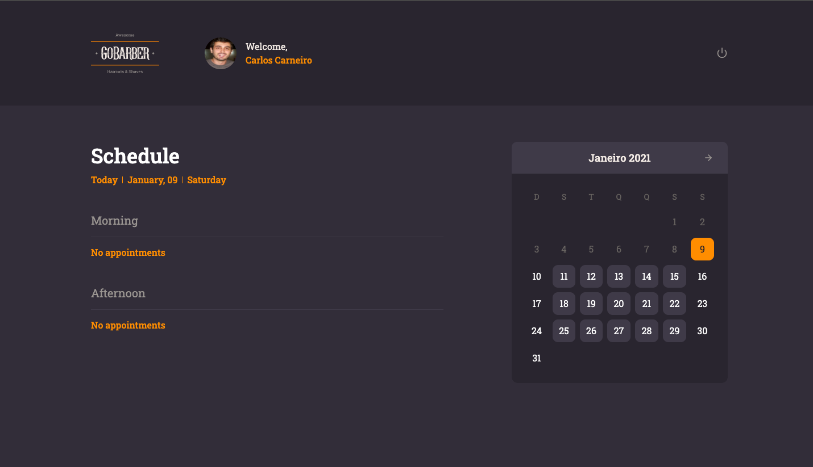

# Web GoBarber

This is the web interface for the GoBarber app

# How to run
Make sure you have the [api-go-barber](https://www.github.com/cacpmw/api-go-barber) running.

1. Run `yarn && yarn start`